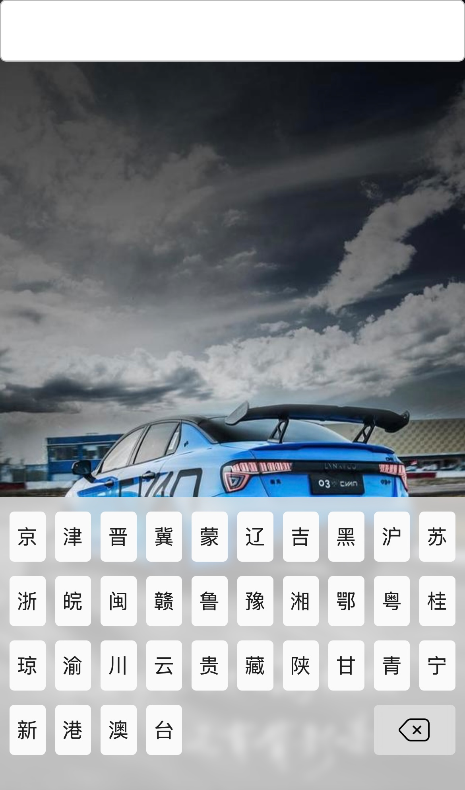
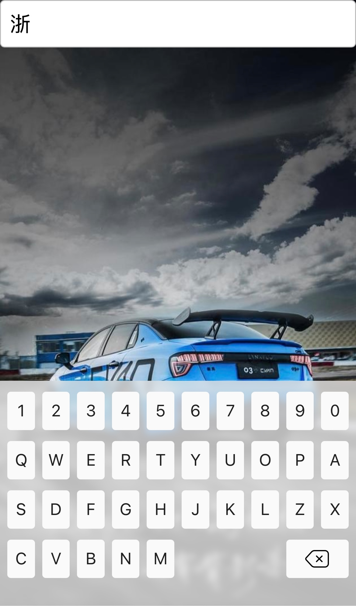
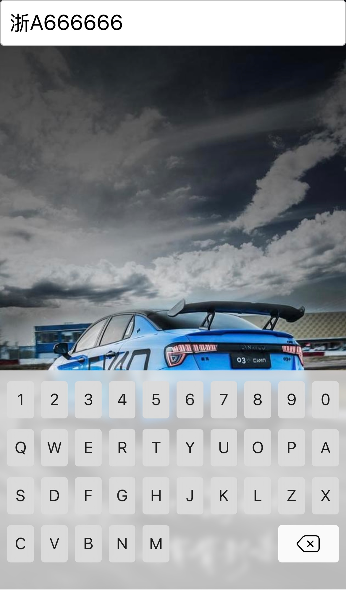

# plate-no-keyboard

### 介绍
* plate-no-keyboard是一款基于vue3的车牌号输入控件。

### 项目中使用

* 下载
```
npm install plate-no-keyboard
```

* 在main.js中引入
```js
import PlateNoKeyboard from 'plate-no-keyboard'
import 'plate-no-keyboard/dist/index.css'

createApp(App).use(PlateNoKeyboard).mount('#app')
```

* 在需要的页面中使用
```html
<template>
  <input class="text-input" type="text" readonly v-model="value" @click="$refs.PlateNumberKeyboardRef.open()">

  <plate-no-keyboard
    ref="PlateNumberKeyboardRef"
    v-model="value"
    @change="onChange"
    @delete="onDelete"
    @print="onPrint"
    @open="onOpen"
    @opened="onOpened"
    @close="onClose"
    @closed="onClosed"
  />
</template>
```
```js
<script>
export default {
  name: 'App',
  data () {
    return {
      value: ''
    }
  },
  methods: {
    onChange (v) {
      console.log('onChange', v)
    },
    onDelete (v) {
      console.log('onDelete', v)
    },
    onPrint (v) {
      console.log('onPrint', v)
    },
    onOpen (v) {
      console.log('onOpen', v)
    },
    onOpened (v) {
      console.log('onOpened', v)
    },
    onClose (v) {
      console.log('onClose', v)
    },
    onClosed (v) {
      console.log('onClosed', v)
    }
  }
}
</script>

```

* 展示效果

<div style="display: flex">
  
  
  
</div>


### Props
名字 | 类型 | 默认值 | 说明
-- | -- | -- | --
v-model | `String` | "" |  默认车牌号
maxlength | `String` `Number` | 8 |  最大长度
firstExtend | `Array` | [] |  第一位车牌号扩展
otherExtend | `Array` | [] |  其他车牌号扩展

### Methods

名字 | 参数 | 返回值 | 说明
-- | -- | -- | --
open | - | - |  打开键盘
close | - | - |  关闭键盘

### Events
名字 | 参数 | 说明
-- | -- | --
change | value: String | 绑定车牌号变化时触发
print | key: String | 键盘按键按下时触发
delete | - | 删除按键按下时触发
open | - | 打开键盘时触发
opened | height: Number | 打开键盘过渡效果完成时触发
close | - | 关闭键盘时触发
closed | - | 关闭键盘过渡效果完成时触发
